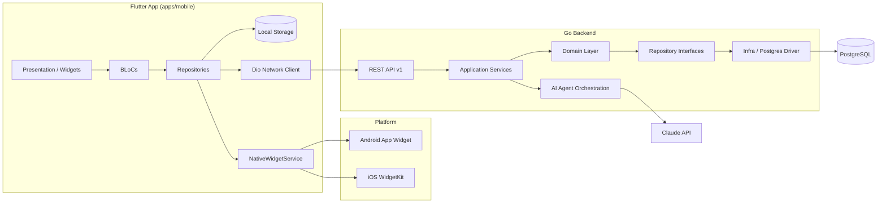
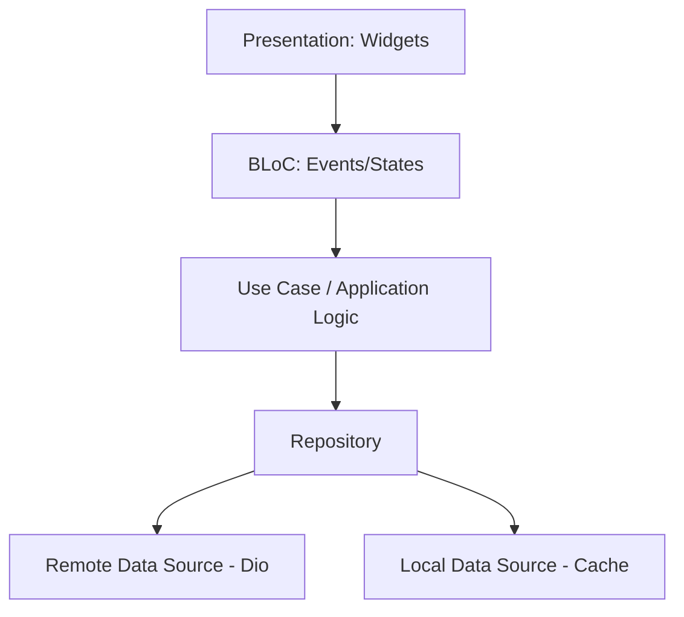
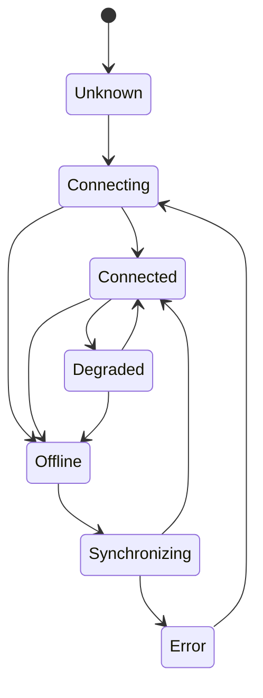
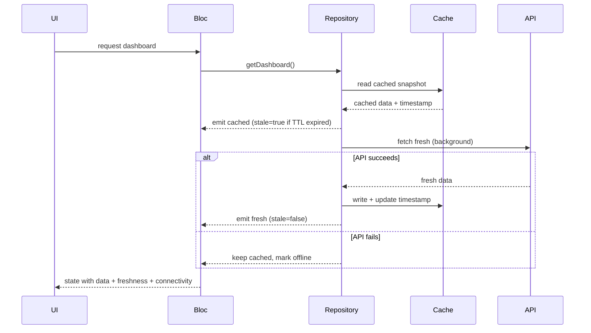
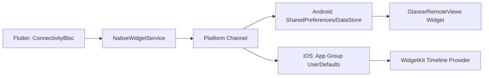
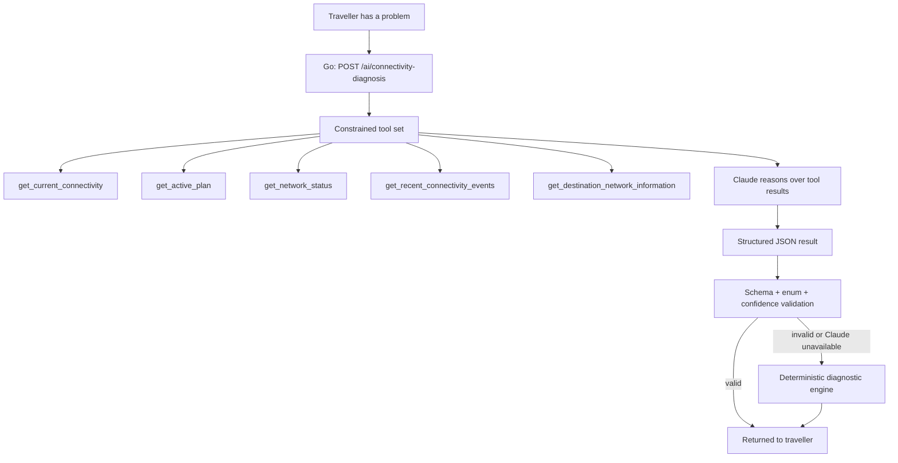
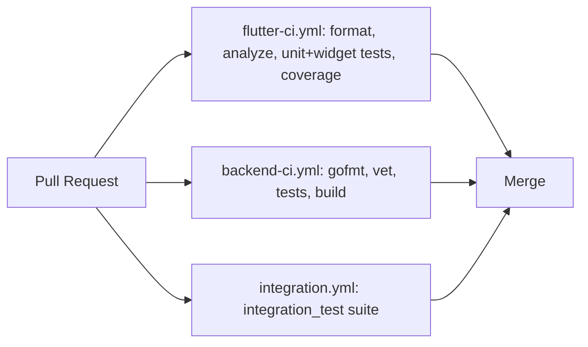

# RoamPulse — Initial Architecture (Phase 0 seed)

Status: seed document. Sections here get their own dedicated docs
(`CACHING_STRATEGY.md`, `NATIVE_WIDGETS.md`, `AI_WORKFLOW.md`,
`TESTING_STRATEGY.md`, `API.md`) as each phase implements them. This file
stays as the high-level map.

## 1. Proposed repository structure

```text
roampulse/
├── apps/
│   └── mobile/                  # Flutter application shell (thin)
├── packages/
│   ├── core/                    # Failures, result types, env/config, logging
│   ├── design_system/           # Colors, typography, spacing, shared widgets
│   ├── network/                 # Dio client, interceptors, error classification
│   ├── storage/                 # Local persistence abstraction (cache, TTL)
│   ├── connectivity/            # Connectivity domain + ConnectivityBloc
│   ├── plans/                   # Plan/usage/destination domain + BLoCs
│   ├── diagnostics/             # Deterministic diagnostic engine
│   ├── ai_agent/                # Claude client contracts + response validation
│   └── analytics/               # Lightweight observability hooks
├── backend/
│   └── api/                     # Go REST API, PostgreSQL, migrations
├── tools/
│   └── ai/                      # AI-assisted dev workflow scripts
├── integration_test/            # End-to-end scenarios (§27)
├── docs/
│   └── decisions/                # ADRs
├── scripts/
├── melos.yaml
├── pubspec.yaml                 # Dart pub workspace root
└── README.md
```

Package boundaries are drawn by **ownership of a domain concept**, not by
layer-for-layer's-sake: `connectivity` owns the connectivity state machine
end-to-end (domain → bloc), it does not get split into
`connectivity_domain` + `connectivity_bloc` packages — that split would add
workspace overhead with no real decoupling benefit (§47).

`apps/mobile` stays thin: routing wiring, DI composition, and app shell only.
Feature logic lives in `packages/*` so it's independently testable.

## 2. System architecture



## 3. Flutter layering



Widgets never import Dio, never construct HTTP requests, and never contain
branching business logic beyond `BlocBuilder`/`BlocListener` state mapping.

## 4. Connectivity data flow



## 5. Offline synchronization



## 6. Data model proposal (PostgreSQL)

```text
users(id, email, auth_provider, created_at)

traveller_profiles(id, user_id fk, display_name, home_country, created_at)

travel_plans(id, traveller_id fk, destination_id fk, esim_id fk,
             starts_at, expires_at, data_allowance_mb, status)

destinations(id, country_code, city, timezone)

networks(id, destination_id fk, carrier_name, technology, mcc, mnc)

esims(id, traveller_id fk, iccid_simulated, status, activated_at)

network_sessions(id, plan_id fk, network_id fk, connected_at,
                  disconnected_at, signal_strength, latency_ms)

usage_records(id, plan_id fk, recorded_at, category, bytes_used)

connectivity_events(id, plan_id fk, occurred_at, from_state, to_state, reason)

diagnostic_sessions(id, plan_id fk, started_at, completed_at, trigger)

diagnostic_results(id, session_id fk, engine, issue, confidence,
                    severity, recommendation, raw_payload jsonb)

sync_metadata(id, traveller_id fk, resource, last_synced_at, checksum)
```

`diagnostic_results.raw_payload` stores both the deterministic engine's
structured output and (when invoked) the validated AI agent output, tagged
by `engine` — this keeps the two auditable and comparable without separate
tables.

## 7. API proposal (versioned REST)

```text
GET    /health

GET    /api/v1/profile
GET    /api/v1/trips/current
GET    /api/v1/plans/current
GET    /api/v1/usage
GET    /api/v1/connectivity
GET    /api/v1/connectivity/events
GET    /api/v1/destinations/:id
GET    /api/v1/networks/:id

POST   /api/v1/diagnostics
POST   /api/v1/ai/connectivity-diagnosis
POST   /api/v1/sync
```

Responses share a consistent envelope:

```json
{ "data": { }, "meta": { "syncedAt": "..." } }
```

Errors share a consistent structure:

```json
{ "error": { "code": "NETWORK_UNAVAILABLE", "message": "...", "details": {} } }
```

Full request/response schemas land in `docs/API.md` (Phase 2) via OpenAPI.

## 8. Native widget strategy



`NativeWidgetService` is a Dart-facing abstraction; Flutter writes a small,
serializable `ConnectivityWidgetPayload` (state, network, data remaining,
expiry) through it. The native widget owns its own rendering — Flutter never
draws widget UI, and the widget must render from last-written storage even
if the Flutter app/engine isn't running. This boundary is unit-testable on
the Dart side (payload construction/serialization) and covered by native
tests for the storage→UI transform on each platform.

## 9. AI agent architecture



The Claude API key lives only in the Go backend's environment. The Flutter
app calls `POST /api/v1/ai/connectivity-diagnosis` like any other endpoint;
it never talks to Anthropic directly.

## 10. Testing strategy (seed — full doc in Phase 13)

- **Unit**: domain models, use cases, repositories, cache TTL/staleness,
  retry logic, diagnostic engine, sync logic, serializers, BLoC state
  transitions.
- **Widget**: connected/offline/degraded/loading/error/stale-indicator
  rendering, diagnostic result rendering, Chaos Mode controls.
- **Integration**: the five scenarios in §27 of the master brief, built
  directly off the primary user journey (§3 of `PRODUCT_DISCOVERY.md`).
- Backend: Go table-driven tests per layer (handler, service, repository)
  plus migration/seed verification.
- AI tests run against **mocked** Claude responses only — no live API calls
  in CI.

## 11. CI/CD strategy (seed — full doc in Phase 14)

Separate workflows so a backend-only or mobile-only change doesn't wait on
unrelated jobs:


